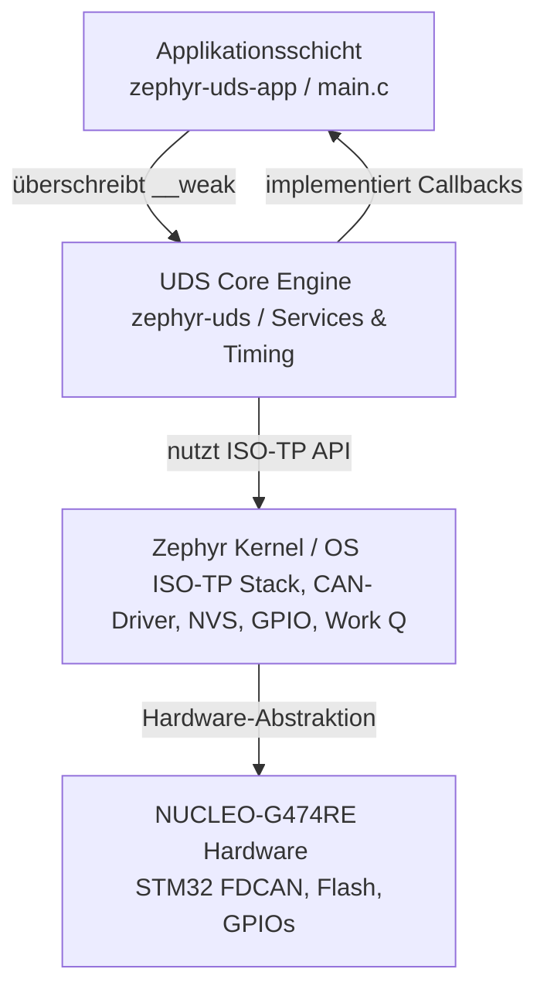

# Zephyr UDS Application (zephyr-uds-app)

Dieses Repository enthält eine Referenz- und Beispielapplikation für das [zephyr-uds Module](https://github.com), einen hardwareunabhängigen und generischen UDS-ISO-TP-Server (ISO 14229-1 / ISO 15765-2) für das Zephyr RTOS. 

Die Applikation implementiert die vom Core-Modul geforderten anwendungsspezifischen Schnittstellen (`__weak` Fallbacks) und bindet diese an die tatsächliche Hardware- und Softwareperipherie von Zephyr an. Sie dient als voll funktionsfähiges Steuergerät (ECU) im CAN-Netzwerk, das Diagnoseanfragen verarbeitet, Hardwarezustände steuert und Firmware-Updates verarbeiten kann.

---

## 🚀 Funktionsumfang der Applikation

Die Applikation erweckt das Protokoll-Core-Modul zum Leben, indem sie die hardwareseitigen und logischen Bindeglieder bereitstellt. Aktuell bildet die Applikation folgende Funktionen und UDS-Dienste ab:

### 🧩 1. Implementierung des Application Interfaces (`__weak` Overrides)
Die Anwendung überschreibt die standardmäßigen Fallback-Funktionen des Cores, um reale Datenoperationen durchzuführen:
* **`uds_app_read_did()`**: Liest herstellerspezifische oder standardisierte Datenidentifikatoren (DIDs) aus und übergibt die Rohdaten (z. B. Sensorwerte, Seriennummern, ECU-Konfigurationen) an den CAN-Sende-Buffer.
* **`uds_app_write_did()`**: Empfängt Datenblöcke vom Tester und persistiert diese dauerhaft im System. Dies ist an das **Zephyr Non-Volatile Storage (NVS)** oder direkt an das Flash-Subsystem gekoppelt (z. B. zum Schreiben von Codierungen oder VIN).
* **`uds_app_calculate_key()`**: Enthält den OEM-spezifischen kryptografischen Algorithmus (Seed-to-Key), um den vom Hardware-Zufallsgenerator generierten Seed in den passenden Schlüssel für die Freischaltung von Sicherheitsstufen zu validieren.
* **`uds_app_io_control()`**: Setzt Stellgliedbefehle direkt in Hardwareaktionen um. Über die **Zephyr GPIO- und PWM-Treiber** werden hierüber Pins geschaltet, Aktuatoren angesteuert oder Komponenten ein- und ausgeschaltet (*Short Term Adjustment* und Freigabe zurück an die ECU).
* **`uds_app_routine_start()` / `uds_app_routine_request_results()`**: Startet anwendungsspezifische System-Tasks (z. B. Kalibrierungsläufe oder Selbsttests) und meldet deren Ausführungsstatus asynchron an den UDS-Core zurück.

### 📥 2. Firmware-Flashing & Bootloader-Pipeline
Die Applikation stellt die vollständige Infrastruktur bereit, um Firmware-Updates über den CAN-Bus via UDS entgegenzunehmen:
* **Download-Einleitung (0x34)**: Nimmt die Update-Anfrage entgegen, validiert das Adressformat sowie die unkomprimierte Datenlänge und bereitet das Flash-Interface vor.
* **Daten-Streaming (0x36)**: Schreibt die sequenziell empfangenen Firmware-Binärdaten Block für Block in die dafür vorgesehene Flash-Partition.
* **Flash-Abschluss (0x37)**: Schließt die Streaming-Pipeline und setzt den Zustand zurück in den Ruhezustand (`FLASH_STATE_IDLE`), sobald die Übertragung fehlerfrei beendet wurde.

### ⏱ 3. Asynchrones Task-Handling & Systemsteuerung
* **System-Reboots (0x11)**: Bei der Anforderung eines Hard- oder Soft-Resets stößt die Applikation Zephyrs native `sys_reboot` API an. Die Ausführung wird präzise verzögert, damit die positive UDS-Antwort den CAN-Transceiver garantiert verlustfrei verlässt.
* **Fehlerspeicher-Management (0x14 & 0x19)**: Löscht bei Anfrage (`0x14`) die Fehlerzustände innerhalb der lokalen DTC-Datenbank live gegen Null und stellt für den Dienst `0x19` (Sub-Function `0x02`) die strukturierte Status-Verfügbarkeitsmaske der aktiven Fehlercodes bereit.

---

## 🛠 Architektur & Schichtenmodell

Die Applikation nutzt die Hardware-Abstraktion von Zephyr RTOS, um maximale Portabilität zwischen verschiedenen Mikrocontrollern zu gewährleisten:

---

## 📋 Voraussetzungen & Konfiguration (NUCLEO-G474RE)

Um die Applikation auf dem STM32G474-Target zu bauen, muss das `zephyr-uds`-Modul im Zephyr-Workspace eingebunden sein. Das Board bringt dedizierte **STM32 FDCAN-Hardware** mit, die vom ISO-TP-Subsystem angesprochen wird.

### Wichtige Kconfig-Optionen
In der `prj.conf` der Applikation sind typischerweise folgende Kernel-Ressourcen aktiviert, um die Funktionen zu unterstützen:

CONFIG_CAN=y
CONFIG_ISOTP=y
CONFIG_GPIO=y
CONFIG_FLASH=y
CONFIG_NVS=y
CONFIG_ENTROPY_GENERATOR=y
CONFIG_REBOOT=y

---

## ⚡ Schnellstart: Bauen und Flashen

1. West Workspace initialisieren
    - west init --local zephyr-uds-app/
    - west update

2. Applikation für das NUCLEO-G474RE Board kompilieren und per integriertem ST-LINK/V3 flashen:

west build -b nucleo_g474re path/to/zephyr-uds-app
west flash
